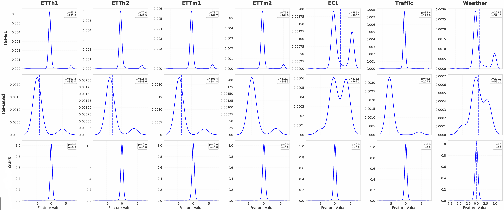
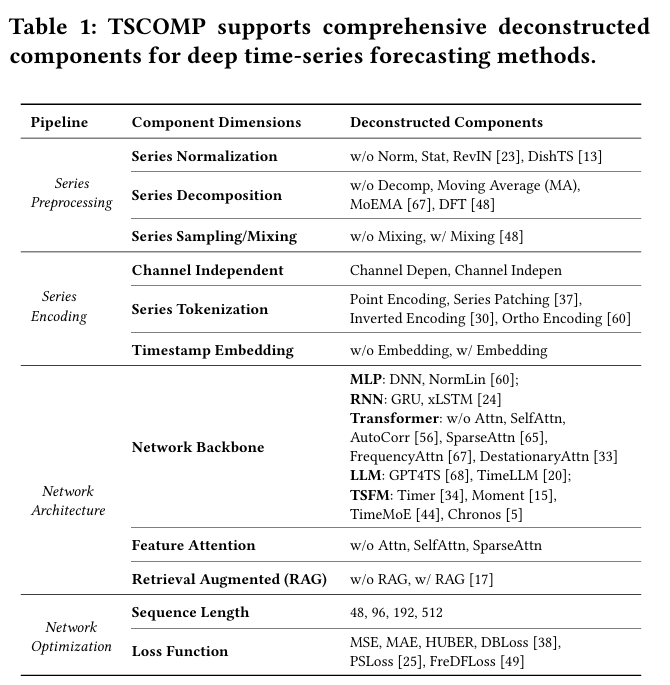
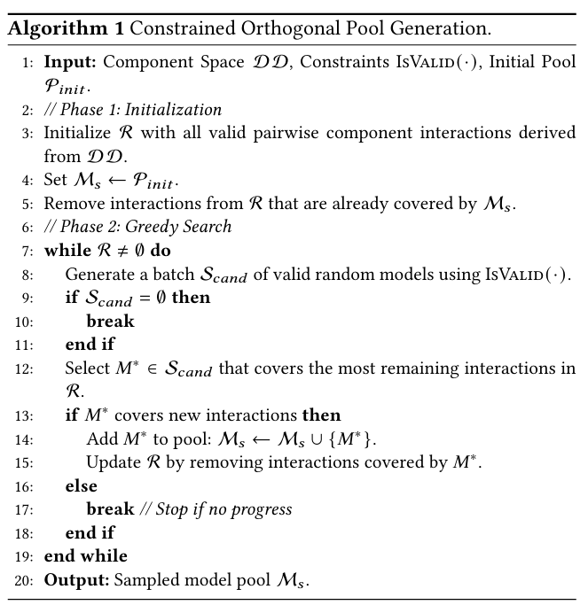

# Beyond Holistic Models: Systematic Component-level Benchmarking of Deep Multivariate Time-Series Forecasting

---

## 🌟 News

- **Meta Learning for Time Series Forecasting**: we add the code for meta-learning-based model selection used in the paper. You can:
  - Run meta learning experiments:
      ```bash
      python meta/run.py --mode simple --test_dataset ETTh2 --meta_model_type mlp
      ```
  - Extract meta-features for datasets:
    ```bash
    python meta/meta_features/get_meta_features_LTF.py --meta_feature_type tabpfn
    ```
  - Apply meta selection to new datasets:
    ```bash
    python meta/run_custom.py --new_dataset my_dataset --checkpoint_path <path> --new_dataset_path <csv_path> --scripts_root <scripts_dir>
    ```


- We add distribution plot analyses of meta-features based on our method (TabPFN-based) and other statistical methods. We found that the meta-features extracted by TabPFN exhibit a more pronounced normal distribution.

<p align="center">
  
</p>


## 🌟 Introduction

Official implementation of **TSCOMP**.

As the field of multivariate time series forecasting (MTSF) continues to diversify across Transformers, MLPs, Large Language Models (LLMs), and Time Series Foundation Models (TSFMs), existing studies typically address concerns about methodological effectiveness by conducting large-scale benchmarks. These studies consistently indicate that no single approach dominates across all scenarios.

However, existing benchmarks typically evaluate models holistically, failing to analyze the multi-level hierarchy of MTSF pipelines. Consequently, the contributions of internal mechanisms remain obscured, hindering the combination of effective designs into superior solutions.

To bridge these gaps, we propose **TSCOMP**, a comprehensive framework designed to systematically deconstruct and benchmark deep MTSF methods. Instead of viewing models as indivisible black boxes, TSCOMP performs a hierarchical deconstruction across three levels: the *Pipeline*, *Component Dimensions*, and *Deconstructed Components*.

---

## 🚀 Method Innovations

- **Comprehensive benchmark via hierarchical deconstruction**
  We propose TSCOMP, the first large-scale benchmark that systematically deconstructs deep MTSF methods. TSCOMP examines the MTSF workflow through a hierarchical design space, spanning from the overall modeling pipeline to fine-grained specific components. To rigorously assess these elements, we design a constrained orthogonal evaluation protocol that isolates the core mechanisms driving forecasting performance.
- **Multi-view analysis and insights**
  We conduct a large-scale analysis that provides both overall and conditional insights. Beyond evaluating general component effectiveness, we extensively investigate performance variations across different backbones (including specific models and emerging LLMs/TSFMs), diverse data domains, and data characteristics. Furthermore, we explore the intricate interaction effects among deconstructed components, verifying community claims with rigorous experimental evidence.
- **Open-sourced corpus and automated construction**
  We open-source the resulting fine-grained performance corpus and validate its utility for model design. This corpus facilitates automated construction of MTSF methods that are adaptively tailored to different forecasting scenarios, consistently achieving better results than state-of-the-art methods.

---

## 🌟 Framework Overview

<p align="center">
  
</p>

**Overview of the proposed TSCOMP framework.** TSCOMP deconstructs existing SOTA models into a modular component pool. Through large-scale experimental analysis, TSCOMP conducts bottom-up evaluation from component-level comparisons to dimension-level and pipeline-level importance ranking. The resulting performance corpus enables automated model construction via a pre-trained meta-predictor that delivers zero-shot, data-adaptive component selection.

### Component-level Deconstruction

<p align="center">
  
</p>

**Deconstructed component taxonomy in TSCOMP.**
We organize forecasting model design into a hierarchical component space for controlled and interpretable benchmarking.

The design space is structured into three levels:

- **Pipeline level:** the standard MTSF workflow is modeled as
  *Series Preprocessing* -> *Series Encoding* -> *Network Architecture* -> *Network Optimization*.
- **Dimension level:** each pipeline stage contains multiple component dimensions, such as normalization, tokenization, and attention mechanisms.
- **Component level:** each dimension includes concrete implementations extracted from SOTA models, such as RevIN normalization, series patching, and sparse attention.

This deconstruction forms a structured and extensible design space that covers diverse modeling strategies.

### Constrained Orthogonal Pool Generation

<p align="center">
  
</p>

**Constrained orthogonal pool generation process.**
Following the protocol in our paper, TSCOMP constructs valid model combinations under compatibility constraints to ensure fair and systematic large-scale evaluation.

**Design Space Complexity.**
The Cartesian product of component dimensions yields more than $10^6$ theoretical configurations. Many combinations are invalid due to mechanism-level incompatibilities (for example, inverted encoding conflicts with channel-independent strategies, and some pre-trained backbones require specific attention protocols). After filtering invalid designs, thousands of candidates still remain, which is computationally prohibitive for multi-dataset benchmarking.

**Pairwise Coverage Criterion.**
To balance rigor and efficiency, we adopt a constrained orthogonal design that targets pairwise coverage of valid component interactions. Compared with exhaustive $k$-way coverage ($k \geq 3$), this strategy is computationally tractable; compared with single-component analysis, it better captures interaction effects. We use a greedy construction process to iteratively select configurations that maximize uncovered valid pairs, resulting in a compact yet representative pool (about 136 models per horizon in our setting).

---

## 📁 Repository Structure

- `data_provider/`: dataset loading and preprocessing.
- `models/`: forecasting model implementations.
- `layers/`: reusable neural network building blocks.
- `exp/`: experiment pipelines for forecasting tasks.
- `scripts/`: generated batch scripts for benchmark execution.
- `meta/`: meta-feature extraction and meta-learning based model selection.
- `figures/`: framework and analysis figures used in the paper and README.

---

## 🚀 Running Experiments

To reproduce the experimental results for TSCOMP, you need to first generate the execution scripts for the Constrained Orthogonal Pool and the Random Pool, and then run these generated scripts.

### 1. Environment Setup

```bash
conda env create -f environment.yml
conda activate tscomp
```

### 2. Generate Execution Scripts (.sh)

Please run the following Python scripts to generate bash scripts for batch testing of short-term and long-term forecasting tasks:

- **Short-term forecasting:**

  ```bash
  python notebooks/bash_generator_short_term_forecasting_sota_seed.py
  ```
- **Long-term forecasting:**

  ```bash
  python notebooks/bash_generator_long_term_forecasting_sota_seed.py
  ```

After executing the above code, a series of `.sh` script files will be generated in `scripts/` (or the output directory specified in the code).

### 3. Run Experimental Scripts

Once generated, you can directly run the `.sh` scripts to build and evaluate the TSCOMP model combinations within the benchmark, for example:

```bash
bash scripts/<generated_script_name>.sh
```

### 4. TSCOMP Corpus & Advanced Analysis

We provide the full experimental results corpus at our [Hugging Face Dataset page](https://huggingface.co/datasets/Braudo/TSCOMP_corpus). Based on this corpus, you can directly perform orthogonal pool statistical analysis and meta-learner training.

#### 4.1. Analyze Orthogonal Pool Results

After extracting the corpus (or running the experiments yourself), you can run the following analysis script to parse evaluation metrics and conduct comparative studies:

```bash
python notebooks/analyze_orthogonal_pool.py
```

#### 4.2. Meta-learning (Optional)

- Run meta learning experiments:

  ```bash
  python meta/run.py --mode simple --test_dataset ETTh2 --meta_model_type mlp
  ```
- Extract meta-features for datasets:

  ```bash
  python meta/meta_features/get_meta_features_LTF.py --meta_feature_type tabpfn
  ```
- Apply meta selection to new datasets:

  ```bash
  python meta/run_custom.py --new_dataset my_dataset --checkpoint_path <path> --new_dataset_path <csv_path> --scripts_root <scripts_dir>
  ```
---

## 📝 Citation

If you find this work useful, please consider citing:

```bibtex
@inproceedings{
liang2026beyond,
title={Beyond Holistic Models: Systematic Component-level Benchmarking of Deep Multivariate Time-Series Forecasting},
author={Shuang Liang and Chaochuan Hou and Xu Yao and Shiping Wang and Hailiang Huang and Songqiao Han and Minqi Jiang},
booktitle={KDD 2026 Datasets and Benchmarks Track},
year={2026}
}
```

---
